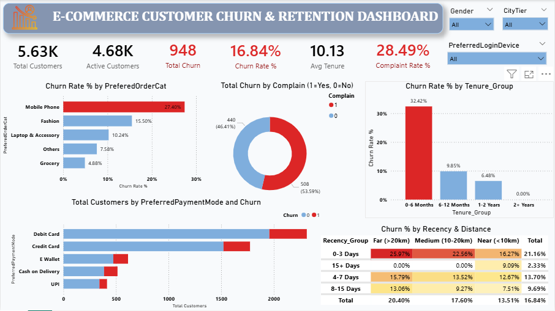

# 🛒 E-Commerce Customer Churn & Retention Analytics

> **An end-to-end data analytics project using Python, SQL, and Power BI to analyze customer churn, identify risk drivers, and propose actionable retention strategies.**

---

## 📌 Project Overview
Customer churn directly impacts revenue growth in the e-commerce sector. This project provides a full-stack data analytics solution to investigate customer behavior patterns, clean inconsistent dataset records, execute deep analytical SQL queries, and deliver an executive Power BI dashboard for real-time retention insights.

---

## 🎯 Key Objectives
* **Data Cleaning & Standardization:** Impute missing values, fix out-of-range records, and merge duplicate categorical categories using Python (**Pandas**).
* **Exploratory SQL Analysis:** Execute targeted SQL queries to segment customer cohorts, identify churn drivers, and build high-risk analytical views.
* **Interactive Dashboarding:** Build an executive-ready **Power BI Dashboard** to visualize critical KPIs, tenure dynamics, and complaint impact.

---

## 📊 Dashboard Preview



---

## 🛠️ Tech Stack & Tools

| Tool / Tech | Usage |
| :--- | :--- |
| **Python (Pandas, NumPy)** | Data preprocessing, median imputation, category mapping |
| **SQL (MySQL / SQL Server)** | KPI calculation, analytical queries, risk cohorting & database views |
| **Power BI** | Data modeling, DAX measures, and interactive KPI dashboarding |
| **Excel / CSV** | Data source handling and storage |

---

## 📈 Key Insights & Business Impact
* **Overall Churn Rate:** **16.84%** across 5,630 customer records.
* **Service Complaints:** Unresolved complaints are the #1 churn driver—customers who registered a complaint showed a **31.7%** churn rate versus **10.9%** for non-complainers.
* **Customer Tenure:** Risk is heavily concentrated in the early lifecycle (**0–6 months**). Retention rates stabilize significantly after **12 months**.
* **High-Risk Segment:** Unchurned customers with low tenure, an active complaint, and no recent activity (`DaySinceLastOrder > 7`) represent the highest risk cohort.
* **Logistics & Payments:** Longer shipping distances (`WarehouseToHome`) and specific payment methods strongly correlate with higher customer drop-off.

---

## 📂 Repository Structure

```text

├── E Commerce Dataset.xlsx          # Raw Dataset

├── clean_ecommerce_churn.csv        # Processed Dataset

├── churn_analysis.ipynb             # Data Preprocessing Notebook

├── churn_analysis_db.sql            # SQL Queries & Views

├── churn_analysis_Report.pbix       # Power BI Report File

├── Powerbi Dashboard.png            # Dashboard Preview Image

└── README.md                        # Documentation

---

## 🚀 Getting Started

1. **Clone the repository:**
   ```bash
   git clone [https://github.com/YOUR_USERNAME/YOUR_REPOSITORY.git](https://github.com/YOUR_USERNAME/YOUR_REPOSITORY.git)

Data Preprocessing:
Run churn_analysis.ipynb in Jupyter Notebook / VS Code to inspect the cleaning pipeline and output clean_ecommerce_churn.csv.

Run Database Queries:
Import clean_ecommerce_churn.csv into your SQL database and run churn_analysis_db.sql.

Explore Dashboard:
Open churn_analysis_Report.pbix in Power BI Desktop.

---

🤝 Author & Contact
Name: Data Analyst

GitHub: @yourusername

LinkedIn: Your LinkedIn Profile
